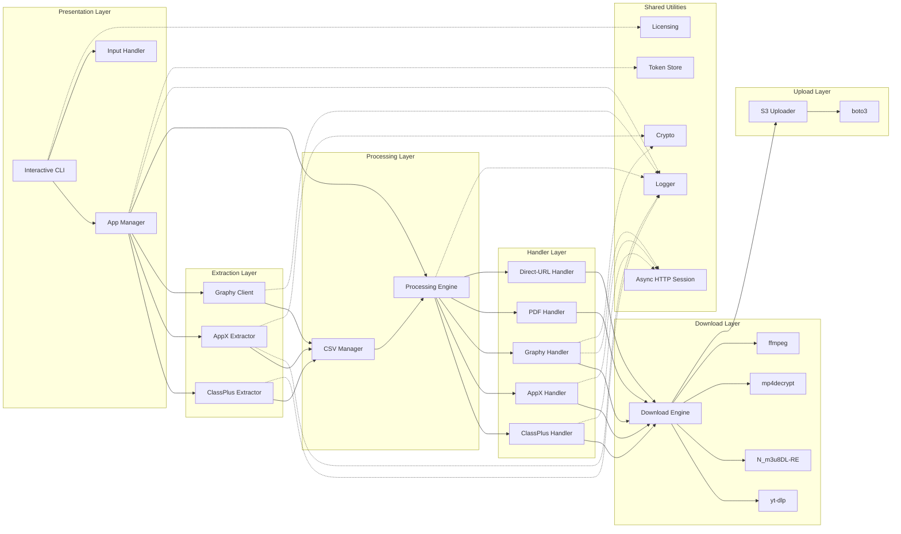
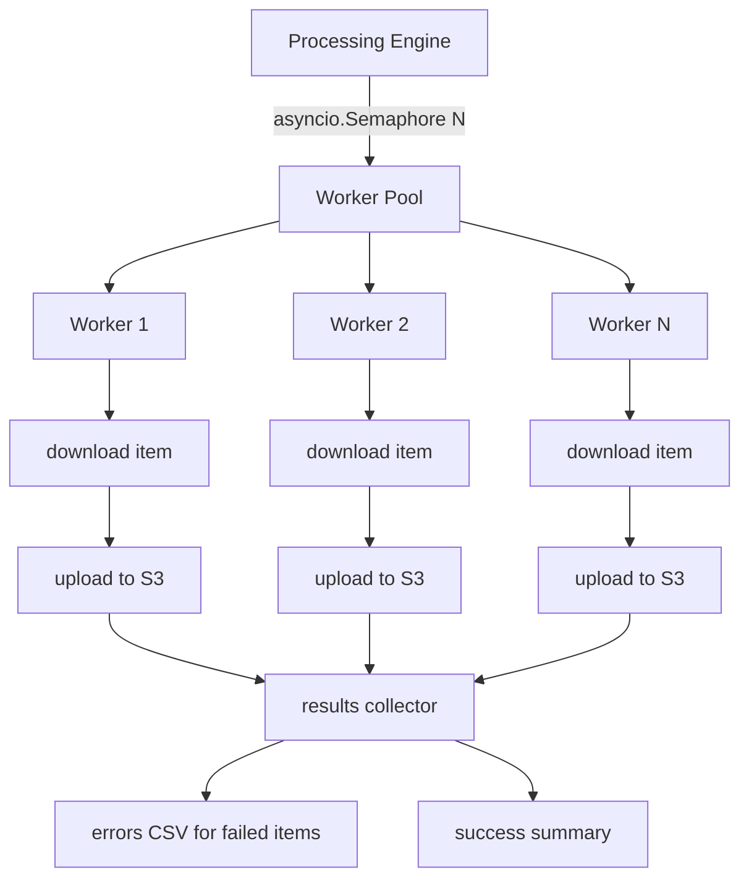
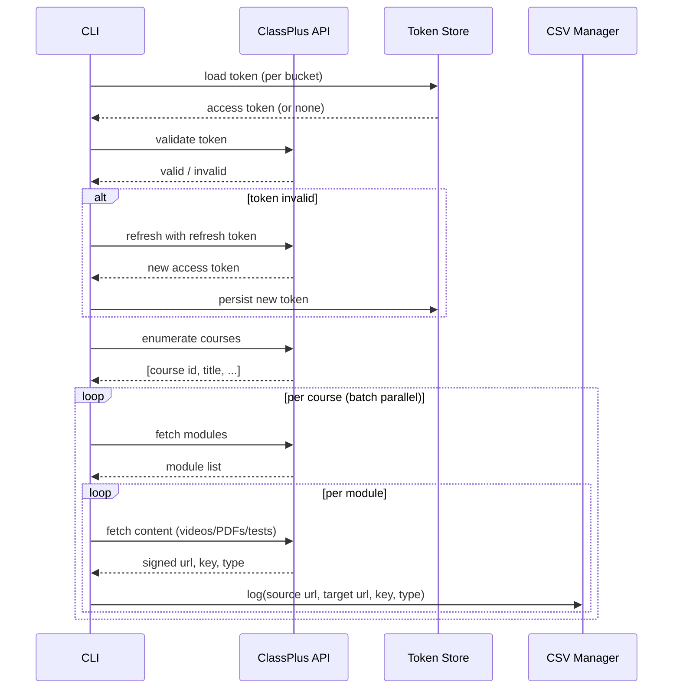
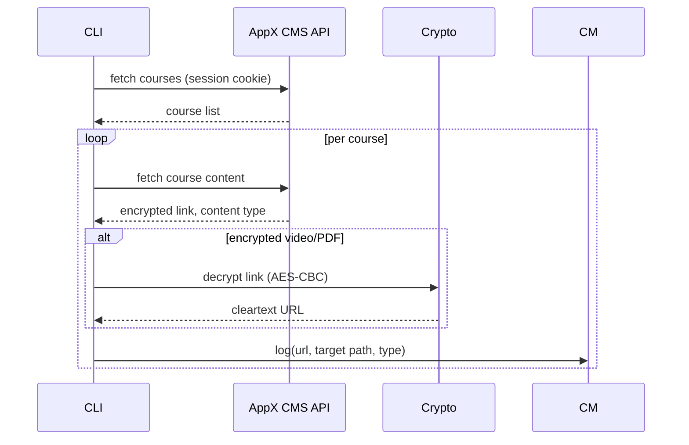
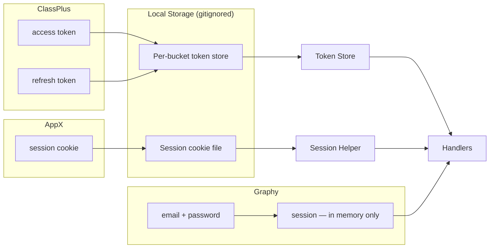
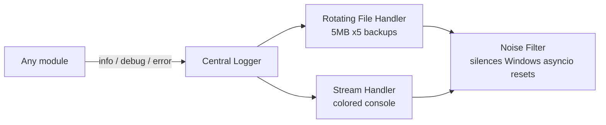
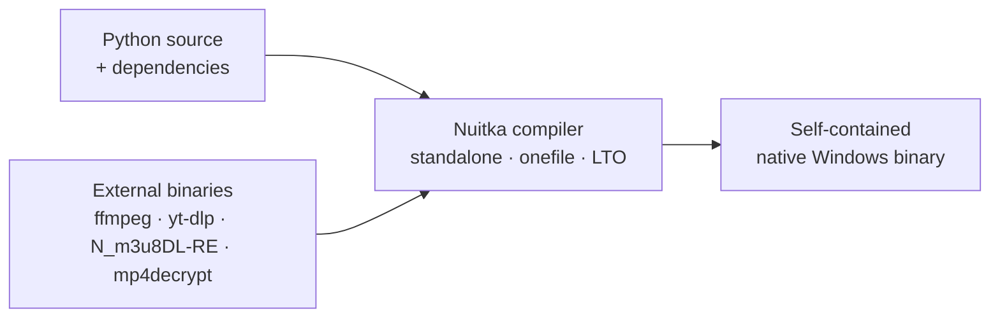

# Architecture — EduXtract

> This document describes the system design at a conceptual level. EduXtract is closed-source; component names below refer to logical responsibilities, not implementation files.

## System Overview

EduXtract is organized as a layered async CLI application. Each layer has a single responsibility; data only flows downward.

```
┌───────────────────────────────────────────────────────┐
│  Layer 1 — Presentation                               │
│  Interactive CLI: app manager + async input handling  │
│  Colorama-powered terminal UI, centered menus         │
└────────────────────────┬──────────────────────────────┘
                         │ dispatch
┌────────────────────────▼──────────────────────────────┐
│  Layer 2 — Extraction                                 │
│  ClassPlus · AppX · Graphy async API clients          │
│  Per-platform enumeration → write structured CSV      │
└────────────────────────┬──────────────────────────────┘
                         │ CSV
┌────────────────────────▼──────────────────────────────┐
│  Layer 3 — Processing                                 │
│  Reads CSV, detects platform mode, dispatches handler │
│  Manages async semaphore pool (1–20 workers)          │
└────────────────────────┬──────────────────────────────┘
                         │ per-item
┌────────────────────────▼──────────────────────────────┐
│  Layer 4 — Handlers                                   │
│  Per-platform auth resolution + download request build │
└────────────────────────┬──────────────────────────────┘
                         │ download
┌────────────────────────▼──────────────────────────────┐
│  Layer 5 — Download Engine                            │
│  yt-dlp · N_m3u8DL-RE · pytubefix · direct aiohttp    │
│  mp4decrypt for Widevine-protected content            │
└────────────────────────┬──────────────────────────────┘
                         │ local file
┌────────────────────────▼──────────────────────────────┐
│  Layer 6 — Upload                                     │
│  boto3 S3 · dedup check · bucket management           │
└───────────────────────────────────────────────────────┘
```

---

## Component Diagram



---

## Async Concurrency Model



The worker count is user-configurable (1–20). Each worker:
1. Acquires a semaphore slot
2. Resolves the download URL (may require platform auth)
3. Delegates to the download engine (subprocess or aiohttp)
4. Calls the S3 uploader on success
5. Logs to the errors CSV on failure
6. Releases semaphore

---

## Platform Extraction Flows

### ClassPlus



### AppX



---

## Token & Auth Architecture



---

## Logging Architecture



Log format:
```
2026-07-20 14:23:01 | INFO     | EduXtract | Target Bucket: <bucket-name>
```

---

## Build System



Nuitka compiles Python to C then to a native executable. With link-time optimization, this also provides code-level hardening that makes reverse engineering significantly harder than a bytecode-based bundle.

---

## Technology Stack

| Category | Technology | Purpose |
|---|---|---|
| Language | Python 3.10+ | Core runtime |
| Async I/O | asyncio + aiohttp | Non-blocking HTTP and file I/O |
| Cloud | boto3 + botocore | AWS S3 operations |
| DRM | pywidevine + mp4decrypt | Widevine key extraction and decryption |
| Cryptography | pycryptodome | AES-CBC decryption |
| Auth | PyJWT | JWT parsing and validation |
| Data | pandas | Structured CSV processing |
| Video | yt-dlp + N_m3u8DL-RE + ffmpeg | HLS and YouTube download |
| Logging | Python logging + colorama | Rotating file + colored terminal |
| Build | Nuitka | Native binary compilation |
| Database | aiosqlite | Local SQLite (async) |
| HTTP | requests + fake-headers | Sync fallback + user-agent rotation |
