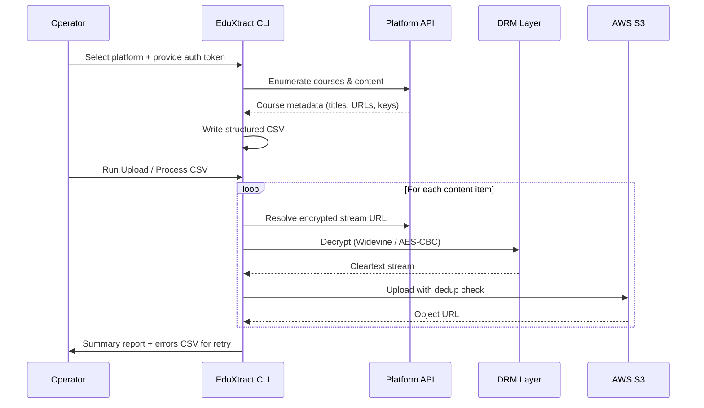

<div align="center">

# 🌑 EduXtract

### Multi-Platform EdTech Content Migration Tool

[](https://www.python.org/)
[](https://www.microsoft.com/windows)
[](https://docs.python.org/3/library/asyncio.html)
[](https://aws.amazon.com/s3/)
[](./LICENSE)

*Extract → Decrypt → Upload. One tool for end-to-end EdTech content migration.*

---

[Features](#-features) · [Architecture](#-architecture) · [Requirements](#-requirements) · [Configuration](#-configuration) · [Usage](#-usage) · [Roadmap](#-roadmap)

</div>

---

## 📌 What is EduXtract?

EduXtract is a **production-grade, async Python CLI** tool built for authorized EdTech operators to migrate course content between platforms. It handles the full pipeline — from API-level extraction through DRM-protected download to cloud upload — across four major EdTech platforms: **ClassPlus**, **AppX**, **Graphy**, and **YouTube**.

> **Note:** This is a **closed-source** tool. This repository contains documentation and architecture only; the implementation is private. The docs here showcase the system's design and engineering.

### The Problem It Solves

When an EdTech academy migrates from one platform to another (e.g., ClassPlus → AppX), their course library — hundreds of encrypted videos, PDFs, mock tests — is locked inside the source platform's proprietary APIs with no official export path. Manual re-upload is infeasible at scale.

EduXtract automates the entire pipeline for authorized platform operators:
1. **Extract** — Enumerate all courses, modules, and file metadata via platform APIs
2. **Decrypt** — Resolve encrypted HLS streams, Widevine-protected videos, and AES-encrypted PDFs
3. **Download** — Parallel async download with error tracking and retry queues
4. **Upload** — Batch upload to AWS S3 with deduplication and progress tracking

> **Authorization requirement**: This tool is intended for use by platform operators and content owners migrating their own content under contractual authorization. It must not be used against platforms or content you do not have rights to access.

---

## ✨ Features

### Platform Support

| Platform | Extraction | Encrypted Download | PDF | Tests | S3 Upload |
|---|---|---|---|---|---|
| **ClassPlus** (paid) | ✅ Full API | ✅ HLS / Widevine | ✅ | ✅ | ✅ |
| **ClassPlus** (free) | ✅ Public API | ✅ | ✅ | ✅ | ✅ |
| **AppX** | ✅ CMS API | ✅ AES-encrypted PDF + Video | ✅ | ✅ | ✅ |
| **Graphy** | ✅ Auth API | ✅ DRM-protected | ✅ | — | ✅ |
| **YouTube** | — | ✅ via yt-dlp / pytubefix (OAuth) | — | — | ✅ |
| **Direct URLs** | — | ✅ m3u8 / HTTP | ✅ | — | ✅ |

### Core Capabilities

- **🔐 DRM Decryption** — Widevine key extraction (`pywidevine` + `mp4decrypt`), AES-CBC PDF decryption
- **⚡ Async Architecture** — `asyncio` + `aiohttp` with configurable parallel workers (1–20)
- **📦 Batch CSV Processing** — Upload entire content libraries from a structured CSV with dedup checks
- **☁️ AWS S3 Manager** — Create/list buckets, auto-upload, make-public, URL existence checks
- **📊 Error Tracking & Retry** — Failed items auto-logged to an errors CSV for one-click replay
- **🔑 Token Management** — Per-bucket JWT storage, automatic token validation + refresh
- **📋 Structured Logging** — Rotating file logger (5 MB × 5 backups) with colored console output
- **🏗️ Native Binary Build** — Nuitka compilation to a standalone executable with all dependencies bundled
- **🛡️ Time-Based Licensing** — Network-verified expiry check (WorldTimeAPI + Google fallback)

---

## 🏛️ Architecture

EduXtract is a layered async application. Data flows downward through six responsibility layers:

```
┌─────────────────────────────────────────────────────────────┐
│  Presentation Layer                                         │
│  Interactive CLI · colored menus · async input handling     │
└───────────────────────────┬─────────────────────────────────┘
                           │ dispatch
┌───────────────────────────▼─────────────────────────────────┐
│  Extraction Layer                                           │
│  Per-platform async API clients (ClassPlus · AppX · Graphy) │
│  Enumerate courses → emit structured CSV                    │
└───────────────────────────┬─────────────────────────────────┘
                           │ CSV
┌───────────────────────────▼─────────────────────────────────┐
│  Processing Layer                                           │
│  Platform-mode detection · async semaphore pool (1–20)      │
└───────────────────────────┬─────────────────────────────────┘
                           │ per-item
┌───────────────────────────▼─────────────────────────────────┐
│  Handler Layer                                              │
│  Resolves auth · builds download request per platform       │
└───────────────────────────┬─────────────────────────────────┘
                           │ download
┌───────────────────────────▼─────────────────────────────────┐
│  Download Engine                                            │
│  HLS · YouTube · direct HTTP · Widevine decryption          │
└───────────────────────────┬─────────────────────────────────┘
                           │ local file
┌───────────────────────────▼─────────────────────────────────┐
│  Upload Layer                                               │
│  AWS S3 (boto3) · bucket ops · deduplication                │
└─────────────────────────────────────────────────────────────┘
```

### Data Flow: End-to-End Migration



See [ARCHITECTURE.md](./ARCHITECTURE.md) for component diagrams, the concurrency model, and per-platform extraction flows.

---

## 🧩 Module Overview

The system is organized into cohesive modules by responsibility (implementation private):

| Module | Responsibility |
|---|---|
| **CLI / App Manager** | Menu system, async input, orchestration of extract/upload flows |
| **Platform Extractors** | One async client per platform — enumerate courses, emit CSV |
| **Processing Engine** | Batch CSV dispatch, platform-mode detection, worker pool |
| **Handlers** | Per-platform auth resolution and download request building |
| **Download Engine** | HLS / YouTube / direct download, DRM decryption orchestration |
| **Upload / Cloud** | S3 client, bucket lifecycle, deduplication, status checks |
| **Shared Utilities** | Crypto, CSV management, async HTTP session, token persistence, logging, licensing |

---

## 🛠️ Requirements

### System
- **OS**: Windows 10 / 11 (64-bit)
- **Python**: 3.10+ (for building from source)
- **AWS Account**: S3 access with read/write permissions

### External Binaries
The following third-party binaries are used and bundled into the standalone build:

| Binary | Purpose | Source |
|---|---|---|
| `ffmpeg` / `ffprobe` | Video muxing, audio sync, stream inspection | [ffmpeg.org](https://ffmpeg.org) |
| N_m3u8DL-RE | HLS playlist downloader | N_m3u8DL-RE |
| `mp4decrypt` | Widevine DRM decryption | Bento4 SDK |
| `yt-dlp` | YouTube + generic video download | yt-dlp |

---

## ⚙️ Configuration

All secrets are loaded from environment variables — nothing is hardcoded. Configuration is supplied via a `.env` file (a template is provided):

```env
# AWS Credentials (required)
AWS_ACCESS_KEY=AKIA...
AWS_SECRET_KEY=your_secret_key
AWS_REGION=ap-south-1

# Concurrency (optional)
UPLOAD_CONCURRENCY=1
```

> ⚠️ **Never commit `.env` to version control.** It is gitignored by default.

### Auth Tokens (per-platform)

| Platform | Auth Method | Storage |
|---|---|---|
| ClassPlus | Bearer JWT (access + refresh) | Local token store (gitignored) |
| AppX | Session cookie | Local file (gitignored) |
| Graphy | Email + password (session) | In-memory only |

---

## 📖 Usage

The tool runs as an interactive CLI with an 11-option menu:

```
┌── Extraction & Administrative Tools ──┐
│  1. ClassPlus Extraction              │
│  2. ClassPlus Free Content            │
│  3. AppX Extraction                   │
│  4. AppX Extraction New               │
│  5. Graphy Extraction                 │
├── Processing & Data Output Tools    ──┤
│  6. AWS Upload / Process CSV          │
│  7. CSV Generator (Normal URLs)       │
│  8. CSV Remove Column                 │
│  9. CSV URL Cleaner                   │
│ 10. Check S3 URLs Upload Status       │
├── System Operation                  ──┤
│ 11. Make Bucket Public                │
│  0. Exit Framework                    │
└───────────────────────────────────────┘
```

### Typical Workflow

```
Step 1: Run Option 1/3/5  →  Extract course metadata → generates CSV
Step 2: Run Option 6      →  Process CSV → download → upload to S3
Step 3: Run Option 10     →  Verify all S3 URLs are live
Step 4: (On failure)      →  Re-run Option 6 with the generated errors CSV
```

### CSV Format (for Option 6)

| Column | Required | Description |
|---|---|---|
| `Source Url` | ✅ | Original content URL (m3u8, YouTube, direct link) |
| `AWS Url` | ✅ | Target S3 path for upload |
| `Key` | Conditional | Widevine/AES decryption key (if DRM-protected) |
| `Type` | Optional | `video`, `pdf`, or `test` (auto-detected if omitted) |

---

## 🔧 Standalone Build

The application compiles to a single self-contained Windows executable via **Nuitka** (native C compilation with LTO). The required third-party binaries are bundled alongside it, so the distributed build runs without a Python installation.

Build time: ~5–15 minutes depending on hardware.

---

## 📋 Logging & Error Handling

| Artifact | Description |
|---|---|
| Application log | Full debug log — rotates at 5 MB, 5 backups kept |
| Errors CSV | Failed items — same schema as the input CSV, ready for one-click retry |

Because the errors CSV shares the input schema, retrying a partial failure is as simple as re-running the upload step with the errors file as input — no manual reconstruction.

---

## 🛣️ Roadmap

See [ROADMAP.md](./ROADMAP.md) for the full plan.

| Priority | Feature | Status |
|---|---|---|
| 🔴 High | Cross-platform support (Linux/macOS via Docker) | Planned |
| 🔴 High | Test suite (pytest + async fixtures) | Planned |
| 🟡 Medium | Web UI / REST API mode | Planned |
| 🟡 Medium | Resume interrupted downloads (checkpoint) | Planned |
| 🟢 Low | Dashboard with progress visualization | Planned |
| 🟢 Low | Plugin architecture for new platforms | Planned |

---

## 🔒 Security

See [SECURITY.md](./SECURITY.md) for the full security policy.

- AWS credentials are loaded exclusively from environment variables — never hardcoded
- Auth tokens are stored in local files (gitignored) — never in code
- Includes a time-based expiry check using network time (anti-tamper)
- DRM decryption is performed only on content the operator is authorized to access

To report a security vulnerability, see [SECURITY.md](./SECURITY.md) — do not open a public issue.

---

## 📜 License

**Private — Internal Use Only.** See [LICENSE](./LICENSE).

This software may not be redistributed, resold, or used outside of its intended authorized migration scope without explicit written permission.

---

## 👤 Author

**BlackOuT** | Application Security Engineer & Python Developer

[](https://github.com/BlackOuTv2)
[](https://www.linkedin.com/in/black0ut/)
[](https://medium.com/@black0uTv1)

---

<div align="center">
<sub>Built with Python asyncio · boto3 · aiohttp · Nuitka</sub>
</div>
